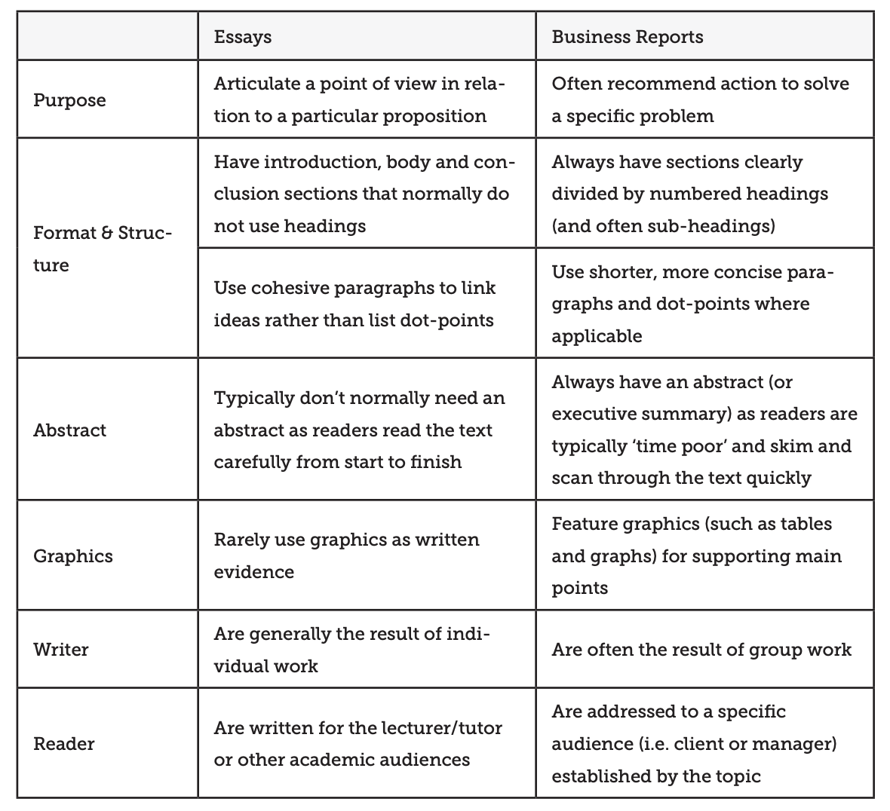

```{r}
#| label: setup
#| include: false

# Put your libraries and dataset loading code here.
```

{width=30% fig-align="center"}

# Assignment instructions

Steam is one of the most popular platforms for distributing video games. Most game developers primarily sell their games through this platform. The platform also has a very robust rating and review system where buyers of games can leave detailed feedback, and this feedback can strongly influence how well a game sells and how likely Steam is to feature/recommend the game. 

An indie game developer who is still deciding on what type of game to make asks you to do an analysis of what types of games are popular on Steam and for what reasons. She asks you to focus on predicting games that sell for a price, as she is not interested in making free to play games. She gives you a dataset of all games on Steam with at least one positive or negative review, released since January 1, 2022. You may wish to further filter your data to include only games you think relevant, but you need to explain your reasoning and it must be reasonable if you do.

She is primarily interested in a metric of the games positive feedback as the response variable and she asks you specifically to consider the genre of the game, whether it is available on PC only or on other platforms, its price, and whether the game continues to be popular even after initial release. How you choose to operationalize, or define, these concepts is a choice left up to you but you need to justify your decisions.

You may need to extract various parts of `Release.date` using the `lubridate` library as discussed [here](https://lubridate.tidyverse.org/). You can see the variable definitions [here]()

You will need to use all the material we learned in class to:

1.  Think carefully about the sampling frame, what your research expectations and questions are, and how the method of data collection can influence your findings
2.  Interpret summary data
3.  Examine important bi-variate relationships
4.  Construct a high-quality regression model of `viewCount` and at least one variable related to each of: the title, description, and publish time.
5.  Interpret this model, including ALL relevant diagnostics and $p$ values.
6.  Propose a plan to the developer about what games are popular and what might be a reasonable type of game to start developing.
7.  Also note the limitations of the report and what other data you think the developer should consider before reaching a final conclusion

## Specific requirements

-   Create a new Quarto document in PDF format and name it `Steam report.qmd`.
-   Rename the title of your report to `Steam report`
-   Add the appropriate date and author information to the header
-   Final report should be between 2000 and 3000 words
    -   Maximum 8 graphs
    -   Maximum 6 tables
-   Suggested structure:
    -   Introduction
    -   Expectations and specific hypotheses
    -   Summary statistics
    -   Regression interpretation
    -   Regression diagnostics
    -   Interpret coefficients
    -   Proposed plan for the developer
    -   Conclusion

## Considerations

Here's a **non-exhaustive** list of things you might want to do:

- Game Rating Determinants: Analyze the relationship between key predictor variables and game rating. Explain which features of a game are the most influential in determining the number of views.

- Adding Additional Variables to the Model: You can create one or several models, but there must be one, final, model that you focus your interpretation on. You can consider more variables than what she requested if you think it would be important to create a good model.

- Filtering Irrelevant Games: There may be some games that are not similar to the types of games the developer is trying to make, you can consider removing these from the analysis.

- Variable Transformations: Consider applying transformations (e.g., log, square root) to some of the variables if they show non-linear relationship between the predictor and response variable. This could improve the accuracy of your regression model.

- Recommendations: Based on your analysis, provide recommendations for the developer as to what kind of game is most likely to receive high popularity. What kind of game should she focus on?

## Points of emphasis

-   Expectations and specfic hypotheses section should include some expectations you develop from finding news articles or studies related to your research question. You should specifically state some hypotheses that seem likely that 1) follow from your literature search and 2) answer the question posed in the Assignment Instructions section.

-   Do not exclude a variable just because it initially does not meet the regression requirements. However, consider carefully whether some variables are actually highly related to another predictor variable -- do not include collinear variables.

-   You should focus your graphs and tables on that illustrating the most important information for drawing your conclusion. Choose your tables carefully such that they convey the key information needed to arrive at your conclusion. Do not make tables and graphs of irrelevant information or points that do not need discussing.

-   Make sure to also interpret the coefficients. You need to interpret the impact of a one unit change in the coefficients on the response variable. You additionally need to examine whether changes in the predictor variables lead to a substantively large or small change in the predictor variable. One way to do this is creating a table of the predictor variables, examining whether a Q1 to Q3 value leads to a large or small change in the response variable. Another way is by the marginal effect plots we have previously used. 

-   Your report should be a polished, quality product that you would be proud to show your boss/employer. No unnecessary printed code, poorly labeled graphs, or strange looking formatting. Use everything you have learned in this class to make a quality final product! Remember, this document is not a formal essay. Some of the differences between a business report and a formal essay are summarized in the table below and by this [link](https://students.unimelb.edu.au/academic-skills/resources/reading,-writing-and-referencing/reports/business-report-structure):



**The below is a suggested structure but you can modify it if the order does not work for you**

# Introduction

# Expectations and testable hypotheses

# Summary statistics

**Must have these three sections (Introduction, Expectations, and Summary statistics) done by the homework check due date (Sunday, December, 7)**

# Regression analysis

## Regression form

## Regression diagnostics

## Interpret coefficients

# Proposed plan for the developer

# Conclusion
